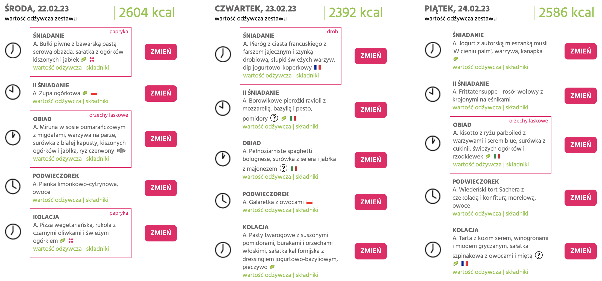

# Chrome extension - LightBox.pl ingredients highlighter

Chrome extension for highlighting ingredients you might be allergic to on LightBox.pl (diet catering)

This is PoC and only highlights ingredients hardcoded in the config file `src/config.json` (for now).

| Day view | Meal selection |
|----------|----------------|
|  |  |

## Development

```bash
npm run watch
```

### Installing extension in Chrome Extensions development mode

Check Chrome docs: https://developer.chrome.com/extensions/getstarted#unpacked

1. Enable developer mode in Chrome
2. Make sure you run `npm run watch`, it supports hot reloading
3. Load unpacked extension from `dist` folder

## Releasing

```bash
rm -rf dist
npm run build
version=$(jq -r .version package.json)
filename="chrome-plugin-lightbox-ingredients-${version}.zip"
zip -j "${filename}" dist/*
gh release create "v${version}" \
  --generate-notes \
  "${filename}"
```
